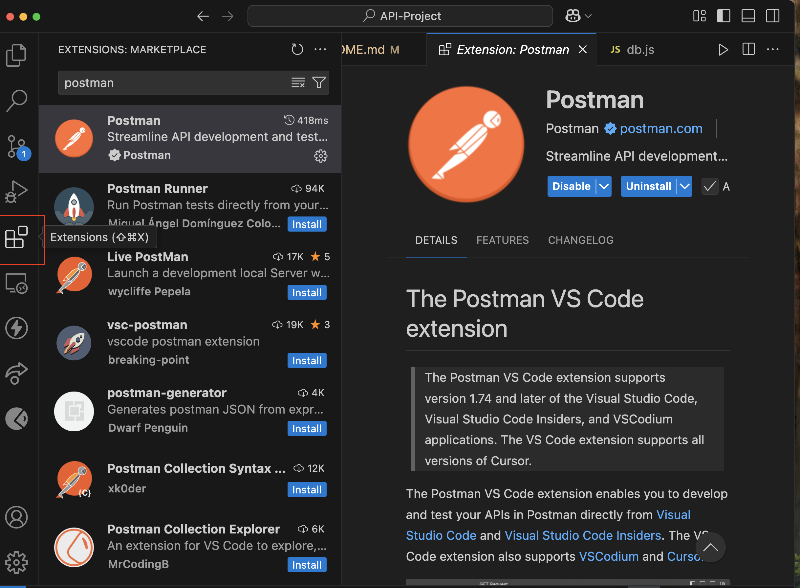
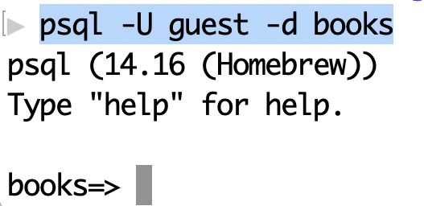
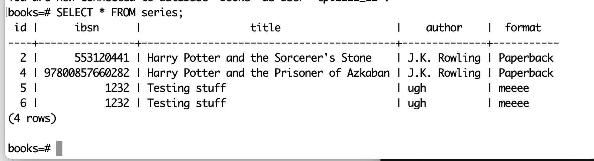
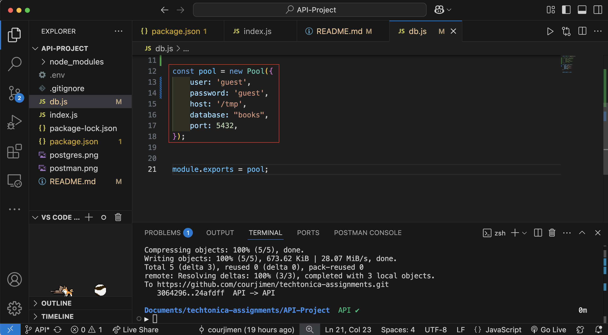

# API Project
This project is focused on building a REST API with Node and Express through your backend server. We will be organizing hardcoded data via postman by following CRUD (Create Read Update Delete) operations and utilizing postgreSQL to connect to local databases.

## Table of Contents
1. [Installation Instructions](#installation)

2. [How to Run Project Locally](#run-project-locally)

3. [Connect to my Database](#connect-to-my-database-in-postgresql)

4. [Demo](#demo)


## Installation
Prior to jumping into my project make sure you have: 

- postgreSQL and Express installed on your local computer
-  node and postman installed in your preferred code editor

My instructions are specified for **MAC users.** 

Here is a step-by-step guide to  you can installing [postgreSQL with homebrew](https://mcengkuru.medium.com/how-to-install-psql-on-your-mac-a-step-by-step-guide-with-troubleshooting-tips-ade65c441abf) from your command line terminal.

The code editor I used for this project was VS Code. 
- Follow these steps to [install Express](https://expressjs.com/en/starter/installing.html) on your VS Code terminal (they also provide documentation to install node.js)

- I used the postman extension in VS Code. Navigate to the extensions tab on the right side of your VS Code Editor and search for Postman




✅ **You _MUST have these installed_** in order to run my project.

## Connect to my database in postgreSQL
Use this command in  your MAC terminal

```bash
psql -U guest -d books
```
It should respond with this:



Now you can modify the date in my table: **series** Run this command to see what data I currently have

```bash
SELECT * FROM series;
```

It should display this within your terminal:




## Run Project Locally
_Please switch to the <INS>API BRANCH</INS> before cloning_

Clone my project

```bash
git clone https://github.com/courjimen/techtonica-assignments.git
```

Go to the project directory

```bash
cd API-Project
```

Open in VS Code
```bash
code .
```
Navigate to the db.js file and update the credentials to the following:



✅ Open the link to see my database of books on localhost:3000/books

```bash
npm run start
```
## Demo
Now you should be able to modify my database from your command line (MAC Terminal) or Postman 🎉 Below are the four CRUD operations you can use to modify my database in Postman and your MAC Terminal: 

### <ins>Postman</ins>
**POST** 

**GET**

**PUT**

**DELETE**

### <ins>MAC Terminal</ins>
_remember to mind capitalization and <ins>ALWAYS</ins> put a semicolon at the end of your postgreSQL command or it will not run_

To Create a new book use the following command: 
```bash
INSERT INTO series (ibsn, title, author, format) VALUES (01234, "insert_title", "insert_author", "insert_format");
```
It should display this:


To Create a new book use the following command: 
```bash
npm run start
```

To Create a new book use the following command: 
```bash
npm run start
```

To Create a new book use the following command: 
```bash
npm run start
```