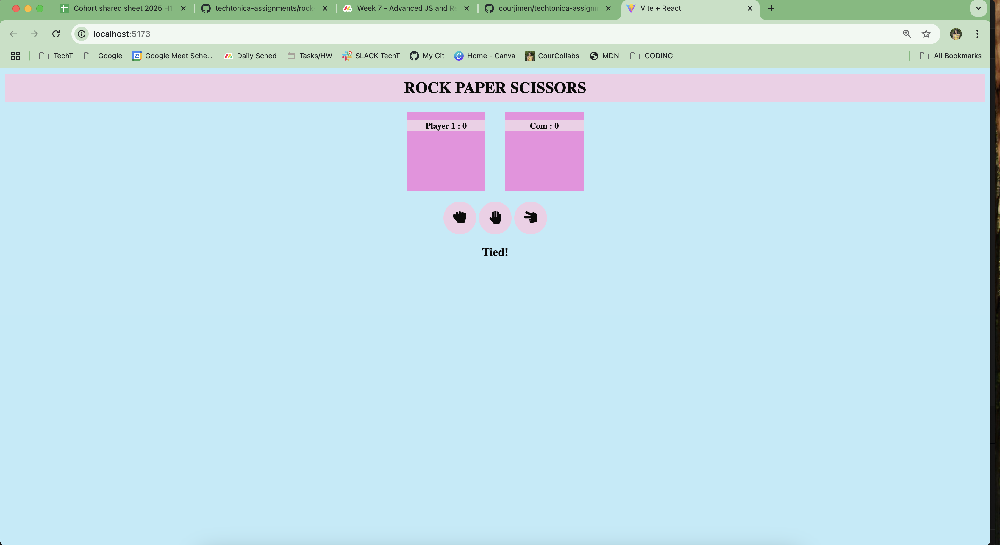
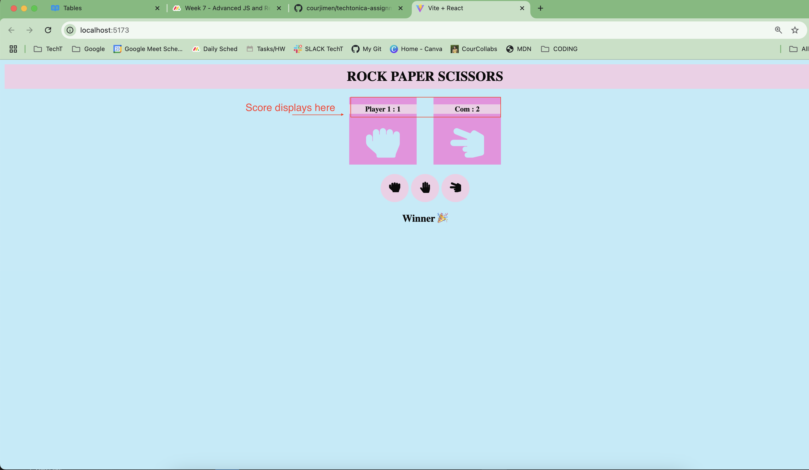

# Let's Play Rock, Paper, Scissors
This game is a simple rock, paper, scissors. Click the symbol for what you want to play and try your luck against the computer! Instructions on how to play and a demo are below.

## Table of Contents
1. [Installation Instructions](#installation)
2. [Game Instructions](#how-to-play)
3. [Demo](#demo)

## Installation
1. Installing data from db.sql
- open postgres on your terminal 
```bash
psql postgres
```
- copy paste the contents from the db.sql file to create your tables

## How to Play
_Please switch to the <INS>Game Branch</INS> before cloning_

Clone my project

```bash
git clone https://github.com/courjimen/techtonica-assignments/tree/Game
```

Go to the project directory

```bash
cd rock-paper-scissors
```

Open in VS Code
```bash
code .
```
Run this code in your terminal
```bash
npm install
npm run dev
```
Follow the local host link and enjoy the game!

## Demo
Once you follow the local host link it should display this:

| Home Screen | Play Screen |
|--|--| 
||

Then you can click whichever symbol you'd like to play and it will track your score and let you know if you've won or tied with the computer.
